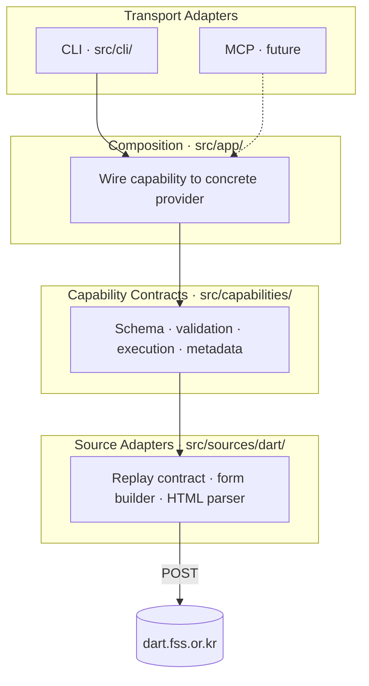

# Architecture

This repo now has two layers:

- root docs that hold product and source-contract decisions
- a small implementation slice under `src/` plus opt-in live checks under `test/` for the first `dsab007` search capability

## Big Picture

The CLI is not the real app. The capability layer is: a semantic request
contract, a provider interface, and an execution path that normalizes errors and
shapes results. The CLI is one transport adapter over that core, and a future MCP
tool should sit at the same layer.



The key mental model has two dimensions:

**Schema derivation** — one schema definition flows outward into multiple surfaces:

```
contract.ts (Effect Schema + annotations)
  -> types.ts (extract inputProperties, JSON Schema)
    -> spec.ts (transport-neutral manifest)
      -> CLI flags, help text, examples
      -> JSON Schema for MCP / other adapters
```

**Runtime pipeline** — a request flows inward through the layers:

```
CLI flags / MCP input
  -> partial raw input (semantic names)
  -> capability resolver (defaults, validation)
  -> public request
  -> provider (source adapter)
  -> DART replay input -> form POST -> HTML parse -> source rows
  -> public result envelope
  -> JSON to stdout
```

For detailed diagrams of each flow, see
[src/ARCHITECTURE.md](src/ARCHITECTURE.md).

## Document Ownership

- [README.md](README.md)
  Orientation, repo stance, and reading order.
- [VISION.md](VISION.md)
  Product-level goal, scope, and non-goals for the current project.
- [docs/research/dart-source-map.md](docs/research/dart-source-map.md)
  Durable source investigation notes for `dsab007` search and the report viewer.
- [docs/tools/](docs/tools/)
  Canonical home for single-tool design.
- [docs/specs/](docs/specs/)
  Stable, evidence-backed capability specs once the contract is ready.
- `src/`
  Current implementation root for `dsab007` contracts, request building, parsers, CLI commands, and colocated deterministic tests.
- `test/`
  Opt-in live or broader integration checks that should stay separate from module-local fixture tests.
  Use `test/live/` for live DART coverage and `test/cli/` for subprocess CLI smoke tests.

## Contributor Flow

1. Start with [README.md](README.md).
2. If the work is about the current product, read [VISION.md](VISION.md) first.
3. Use [docs/research/dart-source-map.md](docs/research/dart-source-map.md) to understand what the live source actually exposes today.
4. Use [docs/tools/foundations.md](docs/tools/foundations.md) and the linked tool docs to shape the contract.
5. Promote only evidence-backed, implementation-ready capability specs into [docs/specs/](docs/specs/README.md).
6. Keep the first implementation slice small: `dsab007` contracts, shared request/client seams, one mode parser, and CLI before section retrieval.
7. Keep tool rules in the tool docs; link to canonical guidance instead of duplicating it.

## Invariants

- Keep product vision at the repo root, not mixed into specs or plans.
- Keep source investigation notes outside `docs/specs/`; only promote stable contract decisions into specs.
- Keep tool contract rules in [docs/tools/contracts.md](docs/tools/contracts.md), not in project notes.
- Prefer links to canonical guidance over repeating the same rule in multiple files.
- Mark source observations as observed, inferred, or unverified; do not blur them together.

## Current Code Shape

- [src/ARCHITECTURE.md](src/ARCHITECTURE.md)
  Internal code architecture for the current implementation slice:
  transport-neutral capability contracts, CLI wiring, provider composition, and
  the `dsab007` source adapter flow.
- `src/cli.ts`
  Local CLI entrypoint and command dispatch.
- `src/app/`
  Composition roots that wire public capabilities to concrete providers without pushing source imports into `src/capabilities/`.
- `src/cli/commands/`
  Transport adapters that depend only on capability-owned public contracts.
- `src/capabilities/`
  Public capability contracts, provider ports, provider-owned error types, execution flow, and transport-neutral metadata shared by CLI, MCP, or SDK layers.
- `src/sources/dart/dsab007/contents/`
  Internal DART replay adapter for the implemented `contents` mode:
  replay schema, form builder, HTML parser, source models, provider implementation, and replay probes.
- `src/sources/dart/errors.ts`
  Tagged source-adapter errors for invalid replay input, source failures, and parser drift.
- `test/live/`
  Opt-in live DART checks that exercise the shared client seam against the source.

## Runtime Flow

The dominant current flow is:

```
argv -> src/cli.ts -> cli/commands/contents-search.ts -> app/contents-search.ts
     -> capabilities/contents-search/execute.ts -> sources/dart/dsab007/contents/search.ts
     -> /dsab007/search.ax
```

Key boundaries in that path:

- **CLI** is transport-only. It derives flags, help text, and examples from capability-owned metadata and passes a partial raw input object into shared execution.
- **Capability** owns the public contract: semantic inputs, defaults, validation, public result envelopes, and transport-neutral metadata that future CLI or MCP layers can reuse.
- **App** is a composition seam. It chooses which provider backs the capability without pushing DART-specific imports back into the public contract layer.
- **Source adapter** owns DART replay fields, form construction, HTML parsing, and source-drift detection. It maps source failures into provider-owned errors before capability execution normalizes them further.

See [src/ARCHITECTURE.md](src/ARCHITECTURE.md) for detailed runtime pipeline
diagrams, the schema derivation chain, the two-schema boundary, and the MCP
extension seam.

## Current Invariants

- Public inputs stay semantic. Names like `keyword`, `startDate`, and `companyCode` belong in the capability contract; replay fields like `textCrpCik`, `maxResults`, and duplicated `b_*` form fields stay internal to the DART adapter.
- The capability schema is the single source of truth for transport metadata. CLI flags, help text, examples, and JSON Schema should be derived from capability-owned metadata rather than duplicated by each transport.
- CLI and future MCP layers should share capability execution. Transport adapters parse transport syntax, then delegate semantic validation and execution to `src/capabilities/`.
- Provider results stay capability-shaped. Source rows and parser-specific structures should be mapped before they leave `src/sources/`.

## Expected Expansion

If the current single-package shape holds up, expand carefully:

- `docs/specs/` for stable capability specs
- `src/` for the core capability while the surface is still small
- `packages/cli` only if the CLI outgrows a single-package layout
- `packages/mcp` only after the core contract is stable
- `evals/` for scenario-driven tests and transcripts
