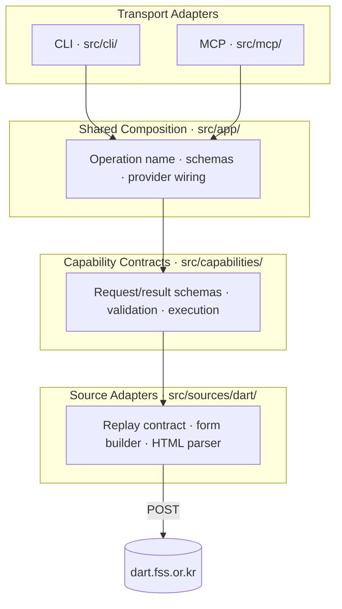
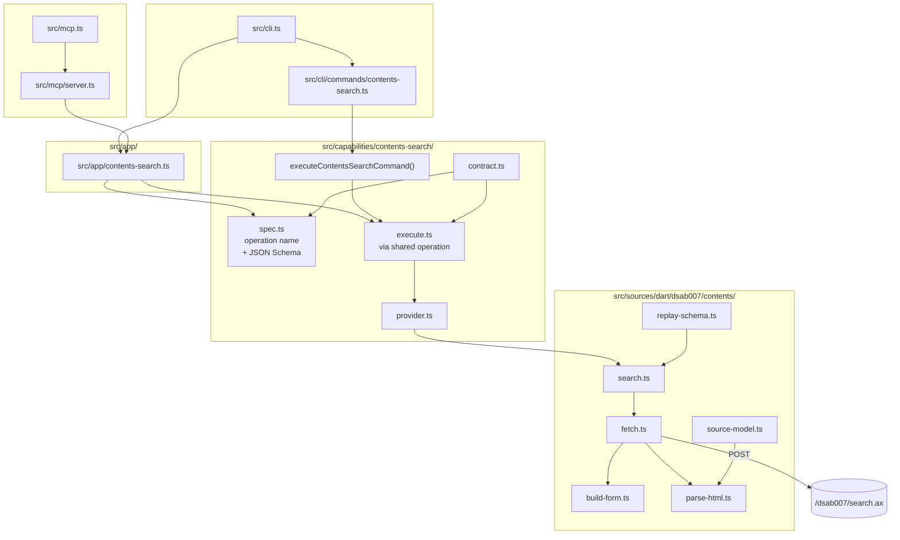
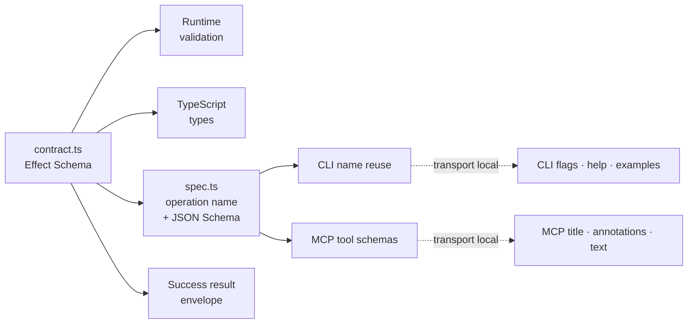
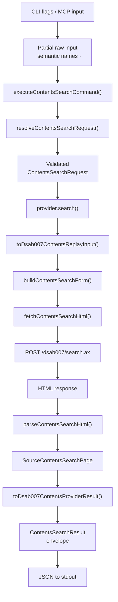
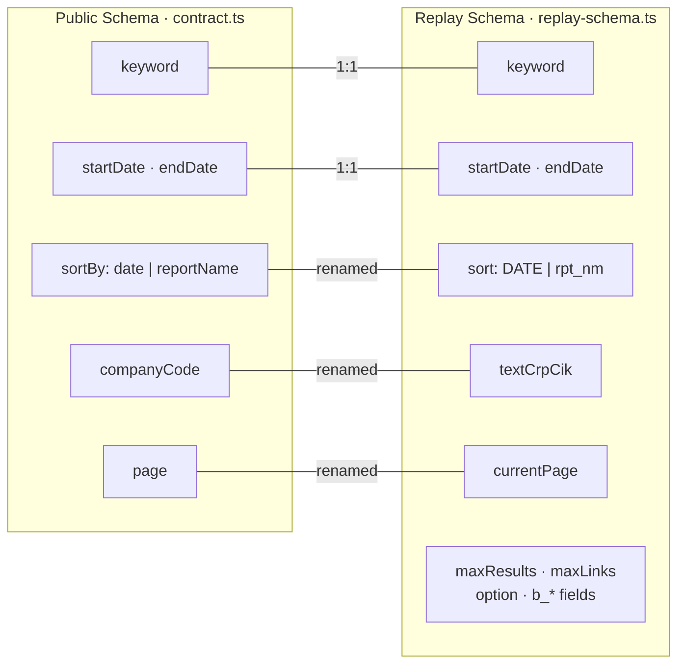
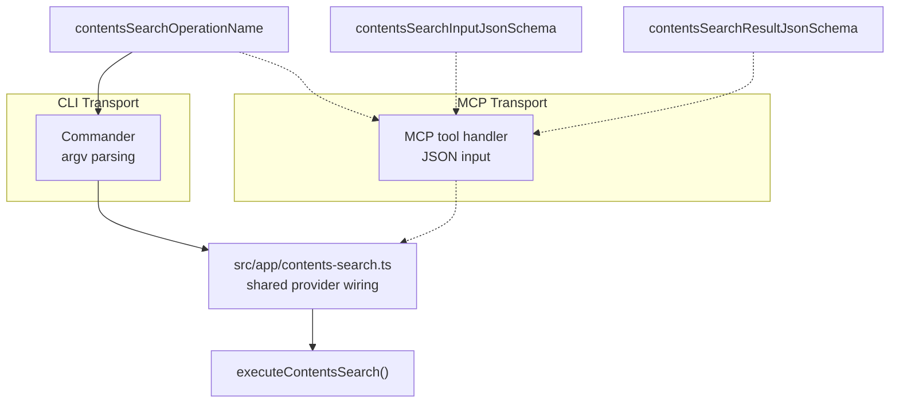

# Source Architecture

This document covers the current implementation under `src/`. It sits below the
repo-root [ARCHITECTURE.md](../ARCHITECTURE.md), which explains the broader repo
shape and document ownership.

## Purpose

`src/` contains the first executable slice of `darty`: one public
`contents-search` capability, local CLI and MCP transports, and one internal
DART `dsab007` source adapter.

The design goal is to keep the core reusable across transports. CLI and MCP now
share the same capability contract and execution path while choosing their own
adapter behavior.

## Layer Overview

The CLI is not the real app. The capability layer is: a semantic request
contract, a provider interface, and an execution path that normalizes errors
and shapes results. CLI and MCP are transport hosts over that same core.

| Layer | Path | Owns |
|-------|------|------|
| **Transport** | `src/cli.ts`, `src/cli/`, `src/mcp.ts`, `src/mcp/` | Parse transport input, own transport UX/protocol metadata, call the shared operation, and serialize results |
| **Composition** | `src/app/` | Share default provider wiring plus machine-readable schema access across transports |
| **Capability** | `src/capabilities/` | Public semantic request/result schemas, JSON Schema export, validation, and execution |
| **Source** | `src/sources/dart/` | DART replay fields, form POST, HTML parsing, error mapping |

## Component Map

- **`src/cli.ts`** — Root Commander program. Registers commands and turns
  failures into a process exit code.
- **`src/cli/commands/`** — CLI transport adapters. Own Commander flags, help
  text, examples, and stdout formatting while delegating semantic validation and
  execution through an injected command runner.
- **`src/mcp.ts` / `src/mcp/`** — MCP stdio transport. Lists tools, advertises
  the shared request/result JSON Schemas, and reports tool errors inside
  `CallToolResult`.
- **`src/app/`** — Shared operation wiring. Exposes the operation name, JSON
  Schemas, and capability executor with the default `dsab007` provider already
  attached.
- **`src/capabilities/`** — Public, transport-neutral contracts and execution
  flow. Defines semantic inputs, success result shapes, typed failures, and
  execution logic.
- **`src/sources/dart/`** — Internal DART adapters. Owns replay schemas,
  request forms, HTML parsing, source models, and error mapping.

## Behavior-First Core

The biggest design choice is **behavior-first core, transport-local UX**. The
shared layer owns semantic schemas and execution behavior. CLI and MCP each own
their own presentation and protocol details.

How it works:

1. **`contract.ts`** defines the public request schema, success result schema,
   typed failures, and semantic validation rules.
2. **`spec.ts`** exports the operation name plus request/result JSON Schemas for
   transports and tooling.
3. **`app/contents-search.ts`** wires those schemas and the shared executor to
   the default provider implementation.
4. **`cli/commands/contents-search.ts`** defines the CLI UX explicitly, then
   delegates to the shared operation.
5. **`mcp/server.ts`** defines MCP tool metadata explicitly, advertises the
   shared request/result schemas, then delegates tool calls to the same shared
   operation.

One source of truth gives you:

- runtime validation shape
- TypeScript types
- success result schema for MCP structured output
- JSON Schema for transport adapters

What is intentionally *not* centralized:

- CLI flags, help text, and examples
- MCP titles, annotations, and text rendering

## Runtime Flow

Step by step:

1. Transport (CLI or MCP) converts transport syntax into a partial
   object keyed by public semantic names (`keyword`, `startDate`, etc.).
2. `executeContentsSearchCommand()` passes the semantic raw input into the
   injected capability executor and prints exactly one JSON payload on success.
3. `resolveContentsSearchRequest()` rejects unknown parameters, then uses the
   public request schema to apply defaults and validate required fields, enums,
   integer bounds, and date formats.
4. `src/app/contents-search.ts` wires the shared capability executor to the
   default `dsab007ContentsProvider`, and both transports reuse that operation.
5. `toDsab007ContentsReplayInput()` translates the public request into the
   internal replay contract (`DATE`/`rpt_nm`, `textCrpCik`, `maxResults`).
6. `buildContentsSearchForm()` encodes the replay input as `URLSearchParams`.
7. `fetchContentsSearchHtml()` POSTs the form body to `/dsab007/search.ax`.
8. `parseContentsSearchHtml()` extracts rows, pagination, and warnings from
   the HTML fragment.
9. `toDsab007ContentsProviderResult()` maps source rows into public items.
10. `buildContentsSearchResult()` wraps the provider result in a
   capability-owned envelope with metadata, references, and warnings.

Semantic validation happens inside the capability executor, not in the CLI.
This is important for MCP: MCP should call the same executor, not reimplement
validation.

## Two Schemas

There are two schemas in play, deliberately kept separate.

- **Public semantic schema** (`ContentsSearchRequestSchema` in `contract.ts`):
  what users and future MCP clients see. Semantic names, clean enums,
  documented metadata.
- **Internal replay schema** (`SourceContentsReplayInput` in
  `replay-schema.ts`): what DART's form actually expects. Raw field names,
  fixed page-size values, duplicated `b_*` parameters.

`toDsab007ContentsReplayInput()` is the only function that knows both. The
replay schema stays internal unless the product decides to expose lower-level
knobs.

## Transport Extension Seam

MCP now reuses the same layer split instead of reimplementing the tool
contract.

The MCP transport reuses:

- `contentsSearchOperationName` — stable operation identifier
- `contentsSearchInputJsonSchema` — tool input schema
- `contentsSearchResultJsonSchema` — successful structured output schema
- `src/app/contents-search.ts` — shared provider wiring plus raw semantic
  execution
- `executeContentsSearch()` — shared validation and error normalization inside
  that operation

CLI and MCP stay aligned on the same public contract and executor while each
host keeps explicit control over adapter wiring.

## Start Here

- `src/cli.ts` — top-level transport entry point
- `src/mcp.ts` — MCP stdio entry point
- `src/mcp/server.ts` — tool registration and `tools/call` handling
- `src/app/contents-search.ts` — shared transport composition seam
- `src/cli/commands/contents-search.ts` — explicit CLI surface over the shared
  operation
- `src/capabilities/contents-search/contract.ts` — public input and output
  contract
- `src/capabilities/contents-search/spec.ts` — operation identifier and
  machine-readable request/result schemas
- `src/capabilities/contents-search/execute.ts` — shared validation,
  execution, and error normalization
- `src/sources/dart/dsab007/contents/search.ts` — public-to-source mapping
  and provider boundary

## Test Coverage Map

Tests make the design relationships explicit:

- `spec.test.ts` — request/result JSON Schemas come from the same core schemas
- `contents-search.test.ts` — CLI surface is explicit while still delegating to
  the shared executor
- `mcp/server.test.ts` — MCP tool listing and tool calls reuse the same core
- `contract.test.ts` — semantic resolution is shared and transport-independent
- `execute.test.ts` — provider errors get normalized into capability-owned failures
- `test/cli/` — subprocess CLI reflects the shared core

## Invariants

- Public capability modules do not import DART-specific replay schemas or parser
  models. That boundary keeps future transports independent from source details.
- CLI parsing stays shallow. Required fields, defaults, enum checks, and public
  validation happen in capability execution, not in Commander option handlers.
- Provider implementations return capability-shaped results, not raw source page
  structures.
- The replay contract is intentionally richer than the public contract. Fields
  that exist only to satisfy DART form behavior stay internal until the project
  decides they are stable public knobs.
- The capability layer is the single source of truth for semantic behavior and
  machine-readable request/result schemas.
- CLI and MCP are allowed to duplicate small amounts of transport UX metadata
  rather than forcing one shared manifest abstraction.
