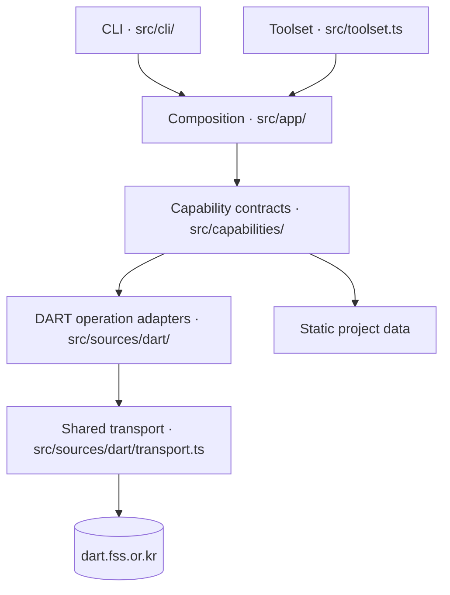

# Source Architecture

This document covers the shipped TypeScript implementation under `src/`. It is
the runnable baseline until the rewrite's atomic cutover, not the accepted
target architecture. Root [ARCHITECTURE.md](../ARCHITECTURE.md) owns the
shipped/candidate/target status boundary.

## Scope

The source tree implements eight public operations:

- source-backed: `search-body`, `search-company`,
  `search-company-reports`, `company-detail`, `company-rss`, and `view-report`;
- static: `disclosure-types` and `report-guide`.

The distributed surface is the `darty` CLI. The source-local toolset remains
a comparison adapter for the rewrite, but is no longer exported as an npm
product. Both reuse the same capability core. Pi adapters are not supported.

## Layers

| Layer | Owns |
|---|---|
| `src/cli/` and `src/toolset.ts` | Public host contracts, CLI flags/help, process serialization, and toolset discovery/execution |
| `src/app/` | Operation names, schema access, default provider wiring, and shared composition |
| `src/capabilities/` | Semantic request/result schemas, validation, typed failures, projections, and execution |
| `src/sources/dart/<surface>/` | Upstream request mapping, source models, HTML/XML parsing, sanitization, and operation-specific error mapping |
| `src/sources/dart/transport.ts` | Shared origin, redirect, status, media-type, charset, deadline, size, cancellation, and body-cleanup policy |

## Component boundaries

- `src/cli.ts` starts the executable; `src/cli/program.ts` owns Commander
  registration and converts failures into the CLI v1 process contract.
- `src/cli/commands/` owns transport-local flags, help, examples, and output
  formatting. Semantic validation stays in capabilities.
- `src/toolset.ts` exposes the same operations to a trusted JS/TS host with
  source-owned schemas, serialized errors, and `AbortSignal` cancellation.
- `src/app/` attaches default providers to capability executors. It contains no
  independent DART implementation.
- Each capability owns its public semantic contract. Low-level replay fields
  remain internal to its source adapter.
- `src/sources/dart/` contains adapters for `dsab007` body and company-report
  search, `dsae001` company search/detail, company RSS, and `dsaf001` report
  viewing. Static operations bypass this layer.

## Request flow

1. A transport parses host-specific input and calls an `src/app/` operation.
2. The capability rejects unknown fields, applies defaults, validates semantic
   constraints, and calls its provider.
3. The provider maps public input into a source-owned request.
4. The shared transport enforces the DART origin and bounded HTTP policy.
5. The operation adapter parses fail-closed into a source model and maps it to
   the capability result.
6. The capability creates the shared success or typed-failure envelope; the
   transport projects and serializes it for its public surface.

`view-report` follows the same flow but first parses `/dsaf001/main.do` into
document/TOC locators, then fetches `/report/viewer.do`. Its source adapter
keeps locators opaque, validates their receipt/document identity, sanitizes
HTML, and produces bounded content windows with best-effort Markdown.

## Contract and transport policies

- Public schemas use semantic names. DART form/query fields and replay-only
  constants stay in source adapters; one mapper is allowed to know both.
- CLI presentation controls such as `pretty`, `verbose`, and `agent` are not
  capability request fields.
- Source parsing fails closed when required tables, pagination, RSS structure,
  viewer documents, or executable TOC grammar changes. Recognized partial rows
  may produce explicit warnings rather than silent success.
- The shared transport accepts only the exact DART origin, disables automatic
  redirects, requires successful HTML/XML media types as appropriate, decodes
  only supported charsets, and enforces connect/idle/total deadlines and raw
  byte caps before parsing.
- Cancellation aborts in-flight reads and cleanup completes before capacity is
  released. Errors expose bounded diagnostics, never raw response bodies,
  cookies, or secrets.
- Viewer HTML is sanitized before publication. Public document and section IDs
  are opaque and must come from the selected shell; callers cannot synthesize
  raw viewer locators.

## Invariants

- The CLI and toolset reuse the capability core; neither owns DART behavior.
- Public success envelopes contain `result`, `metadata`, `references`, and
  `warnings`. Typed failures remain explicit and include recovery hints only
  when a safe next action is known.
- Default projections stay compact while preserving identifiers and references
  required for the next operation. Detailed/raw modes add bounded source
  evidence, not unrestricted upstream bodies.
- Source URLs and references remain tied to the exact returned company,
  filing, document, or section.
- Tests inject providers/transports at the capability or source seam; live
  checks remain opt-in and do not replace fictional conformance evidence.

## Start here

- [`src/app/`](app/) for operation composition.
- [`src/capabilities/`](capabilities/) for public contracts and behavior.
- [`src/sources/dart/`](sources/dart/) for DART adapters and shared transport.
- [`src/cli/`](cli/) and [`src/toolset.ts`](toolset.ts) for CLI and source-local host adapters.
- [Specification index](../docs/specs/README.md) for stable contracts.
