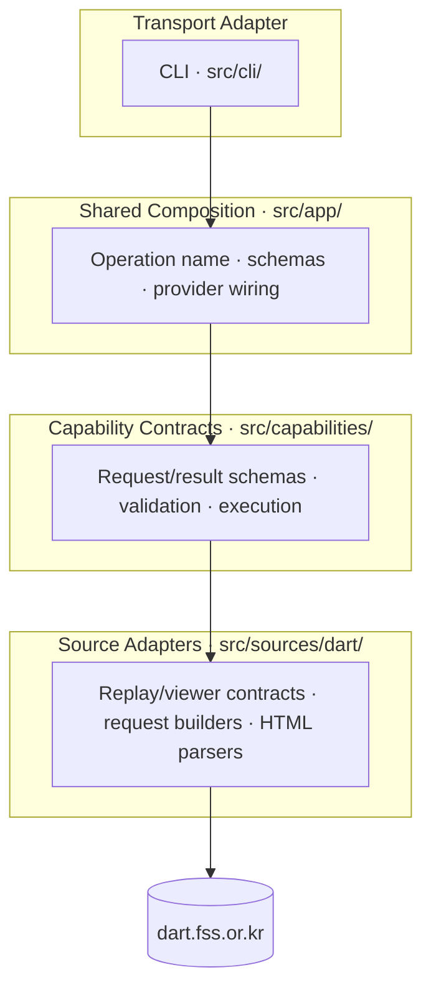
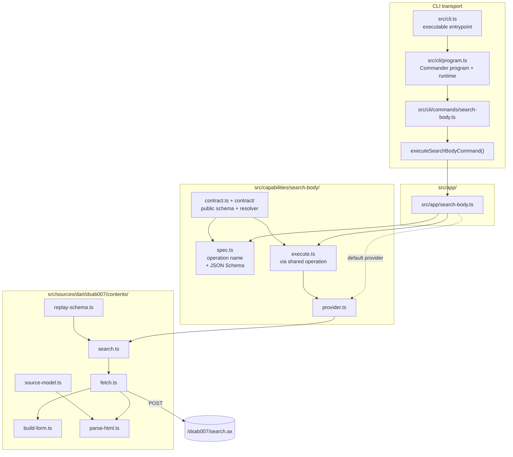
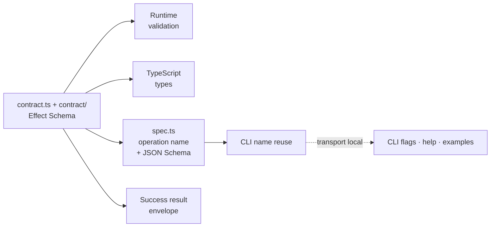
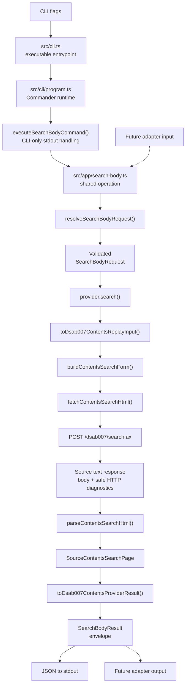
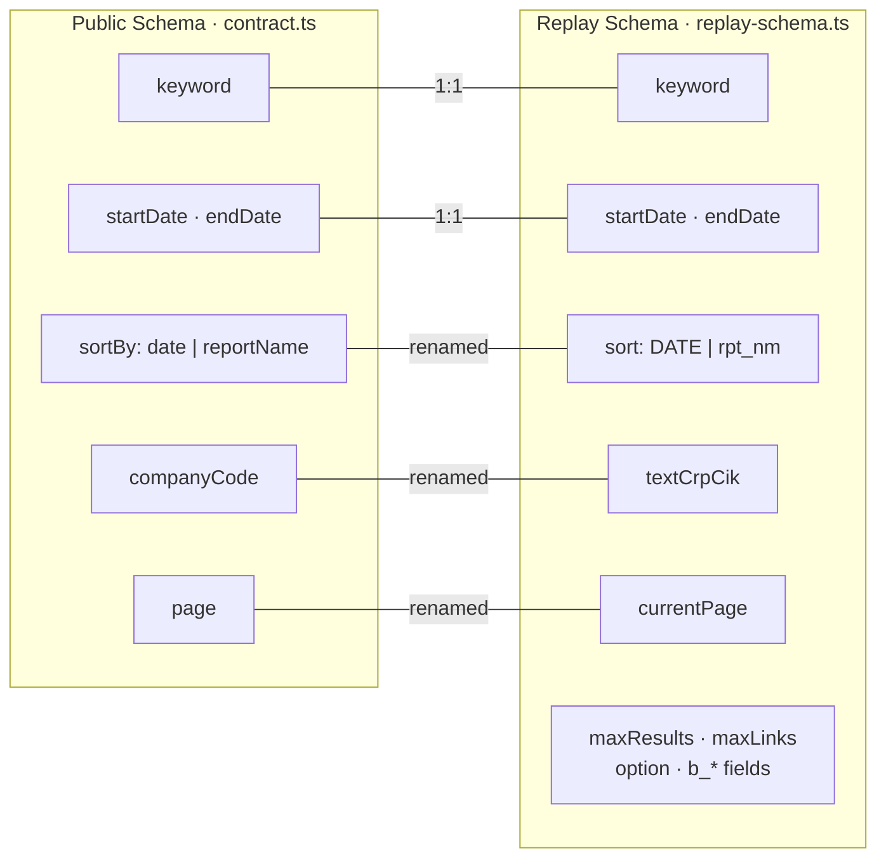
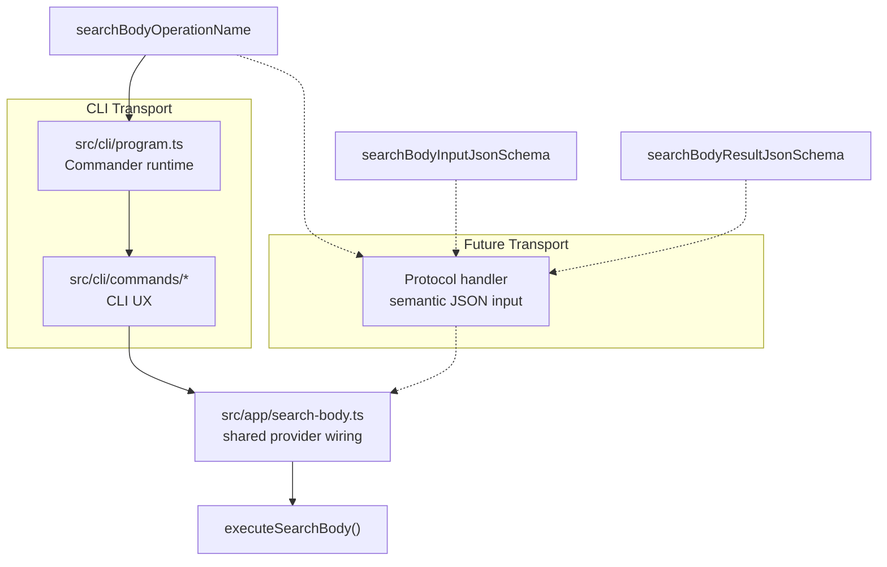

# Source Architecture

This document covers the current implementation under `src/`. It sits below the
repo-root [ARCHITECTURE.md](../ARCHITECTURE.md), which explains the broader repo
shape and document ownership.

## Purpose

`src/` contains the executable slice of `darty`: public `search-body`,
`search-company`, `search-company-reports`, `company-detail`, `company-rss`,
`disclosure-types`, `report-guide`, and `view-report` capabilities, a local CLI
transport, and internal DART source adapters for `dsab007` search, `dsae001`
company overview search/detail, DART company RSS, and `dsaf001` report viewing.
The `disclosure-types` and `report-guide` helpers are static and have no live
DART adapter.

The public design goal is one CLI surface over reusable capability code. The
active public transport is the CLI; future MCP, SDK, Pi, or other adapters should
only be added after the CLI contract is stable and the transport is explicitly
justified.

## Archived MCP Adapter

The early MCP adapter was removed from the active `src/` tree while the project
is greenfield. The exact implementation is preserved at git tag
`archive/mcp-before-removal`. Treat MCP as a future adapter option, not a
current supported transport.

## Layer Overview

The CLI is not the real app. The capability layer is: a semantic request
contract, a provider interface, and an execution path that normalizes errors
and shapes results. CLI is the current transport host over that core.

| Layer | Path | Owns |
|-------|------|------|
| **Transport** | `src/cli.ts`, `src/cli/program.ts`, `src/cli/` | Parse CLI input, own command UX, call the shared operation, and serialize process output |
| **Composition** | `src/app/` | Share default provider wiring plus machine-readable schema access across transports |
| **Capability** | `src/capabilities/` | Public semantic request/result schemas, JSON Schema export, validation, and execution |
| **Source** | `src/sources/dart/` | DART replay/viewer fields, form POST or viewer GETs, HTML parsing, source models, and error mapping |

## Component Map

The diagram shows the established `search-body` path. `search-company`,
`search-company-reports`, `company-detail`, `company-rss`, and `view-report` use
the same transport/app/capability shape through their matching `app/`,
`capabilities/`, `cli/commands/`, and `sources/dart/` modules. The static
`disclosure-types` and `report-guide` helpers use the same
transport/app/capability shape without a `src/sources/dart/` provider.

- **`src/cli.ts`** — Executable CLI entry point. Imports `runDartyCli()` and
  starts the CLI without owning command registration.
- **`src/cli/program.ts`** — Reusable Root Commander program and runtime.
  Registers commands, exposes `createDartyCliProgram()` for tests, and turns
  failures into the CLI v1 JSON failure envelope plus a process exit code.
- **`src/cli/commands/`** — CLI transport adapters. Own Commander flags, help
  text, examples, and stdout formatting while delegating semantic validation and
  execution through an injected command runner. Most command successes and all
  command failures serialize as JSON to stdout; `report-guide` success output
  and help remain human-readable.
- **`src/app/`** — Shared operation wiring. Exposes internal operation names,
  JSON Schemas, and capability executors with the default DART providers already
  attached.
- **`src/capabilities/`** — Public, transport-neutral contracts and execution
  flow. Defines semantic inputs, success result shapes, typed failures, and
  execution logic.
- **`src/sources/dart/`** — Internal DART adapters. Owns replay/viewer schemas,
  request construction, HTML parsing/sanitization, source models, and error mapping.
  `dsab007/contents` powers body-content search; `dsab007/company-reports`
  powers company-code filing search; `dsae001/company` powers company-name
  search; `dsae001/detail` powers company detail lookup; `api/company-rss` powers
  company RSS; `dsaf001/report` resolves receipt
  viewer shells, document selectors, TOCs, content planning, navigation,
  sanitized HTML, and best-effort Markdown.

## Behavior-First Core

The biggest design choice is **behavior-first core, transport-local UX**. The
shared layer owns semantic schemas and execution behavior. The CLI owns
process-level parsing, help text, and final stdout/stderr/exit-code behavior.

How it works:

1. **`contract.ts`** re-exports the public contract modules. The backing
   `contract/` files define the request schema, success result schema, typed
   failures, and semantic validation rules.
2. **`spec.ts`** exports the operation name plus request/result JSON Schemas for
   transports and tooling.
3. **`app/`** wires those schemas and shared executors to the default provider
   implementations.
4. **`cli/commands/`** defines each CLI UX explicitly, then delegates to the
   shared operation.
5. Future adapters should use the same schemas and app wiring only after their
   transport is explicitly justified; the CLI remains the public contract.

One source of truth gives you:

- runtime validation shape
- TypeScript types
- success result schema
- JSON Schema for transport adapters

What is intentionally *not* centralized:

- CLI flags and CLI-specific flag wording
- process-level help text, examples, and formatting
- host-only rendering for adapters that are not part of the active public surface

## Runtime Flow

The detailed diagram below shows the `search-body` path. `view-report`
follows the same transport/app/capability/provider layering, but its source
adapter uses GET requests against `/dsaf001/main.do` and `/report/viewer.do`
instead of the `dsab007` POST replay flow. Inside `dsaf001/report`, `view.ts`
keeps the top-level provider orchestration while `source.ts`, `plan.ts`,
`content.ts`, and `navigation.ts` own fetch seams, content selection, HTML
truncation, and TOC navigation respectively.

Step by step:

1. CLI converts flags into a parsed command with separate `request` and `output` buckets. `request` contains only public semantic capability keys (`keyword`, `startDate`, etc.); `output` contains CLI presentation controls such as `pretty` and `verbose`.
2. Future adapters should convert their protocol input into the same public semantic object and call the shared operation from `src/app/search-body.ts`.
3. `resolveSearchBodyRequest()` rejects unknown parameters, then uses the public request schema to apply defaults and validate required fields, enums, integer bounds, and date formats.
4. `src/app/search-body.ts` wires the shared capability executor to the default `dsab007ContentsProvider`.
5. `toDsab007ContentsReplayInput()` translates the public request into the internal replay contract (`DATE`/`rpt_nm`, `textCrpCik`, `maxResults`).
6. `buildContentsSearchForm()` encodes the replay input as `URLSearchParams`.
7. `fetchContentsSearchHtml()` POSTs the form body to `/dsab007/search.ax` and returns a source text response containing the body, source URL, and safe HTTP diagnostics.
8. `parseContentsSearchHtml()` extracts rows, pagination, and warnings from that source response so parser failures can retain HTTP status/content-type/response-length context.
9. `toDsab007ContentsProviderResult()` maps source rows into public items.
10. `buildSearchBodyResult()` wraps the provider result in a capability-owned envelope with metadata, references, and warnings.
11. The CLI projects the capability envelope into its CLI output contract, then serializes exactly one JSON stdout payload. Default CLI output may omit low-benefit diagnostic/context fields; `--verbose` restores them.

Semantic validation happens inside the capability executor, not in the CLI transport. CLI-only presentation options are kept out of the capability request so future adapters stay aligned without reimplementing validation.

## Two Schemas

There are two schemas in play, deliberately kept separate.

- **Public semantic schema** (`SearchBodyRequestSchema`, re-exported from
  `contract.ts`): what users and future adapters see. Semantic names, clean
  enums, documented metadata.
- **Internal replay schema** (`SourceContentsReplayInput` in
  `replay-schema.ts`): what DART's form actually expects. Raw field names,
  fixed page-size values, duplicated `b_*` parameters.

`toDsab007ContentsReplayInput()` is the only function that knows both. The
replay schema stays internal unless the product decides to expose lower-level
knobs.

## Transport Extension Seam

Future transports should reuse the same layer split instead of reimplementing
tool contracts.

A future adapter should reuse:

- operation identifiers such as `searchBodyOperationName`
- input JSON Schemas such as `searchBodyInputJsonSchema`
- result JSON Schemas such as `searchBodyResultJsonSchema`
- `src/app/*` shared provider wiring plus raw semantic execution
- capability executors such as `executeSearchBody()` for validation and error normalization

This keeps adapters aligned on the same public contract and executor while each
host keeps explicit control over adapter wiring.

## Start Here

- `src/cli.ts` — executable CLI entry point
- `src/cli/program.ts` — reusable Commander program, command registration, and CLI runtime
- `src/app/*` — shared transport composition seams
- `src/cli/commands/*` — explicit CLI surfaces over shared operations
- `src/cli/command-helpers.ts` — small Commander transport helpers shared by
  command files
- `src/capabilities/*/contract.ts` — public input/output contracts, typed
  failures, and request resolution
- `src/capabilities/*/spec.ts` — operation identifiers and machine-readable
  request/result schemas
- `src/capabilities/*/execute.ts` — shared validation, execution, and error
  normalization
- `src/sources/dart/dsab007/contents/search.ts` and
  `src/sources/dart/dsae001/company/search.ts` — public-to-source mapping and
  provider boundaries

## Test Coverage Map

Tests make the design relationships explicit:

- `spec.test.ts` — request/result JSON Schemas come from the same core schemas
- `search-body.test.ts` — CLI surface is explicit while still delegating to
  the shared executor
- `contract.test.ts` — semantic resolution is shared and transport-independent
- `execute.test.ts` — provider errors get normalized into capability-owned failures
- `test/cli/` — subprocess CLI reflects the shared core

## Invariants

- Public capability modules do not import DART-specific replay schemas or parser
  models. That boundary keeps future transports independent from source details.
- CLI parsing stays shallow. Required fields, defaults, enum checks, and public
  validation happen in capability execution, not in Commander option handlers.
- Provider implementations return capability-shaped results, not raw source page
  structures.
- The replay contract is intentionally richer than the public contract. Fields
  that exist only to satisfy DART form behavior stay internal until the project
  decides they are stable public knobs.
- The capability layer is the single source of truth for semantic behavior and
  machine-readable request/result schemas.
- Adapters may duplicate small amounts of transport UX metadata rather than
  forcing one shared manifest abstraction.
