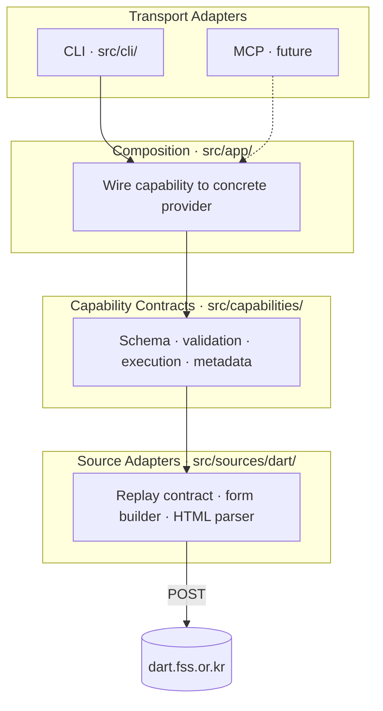
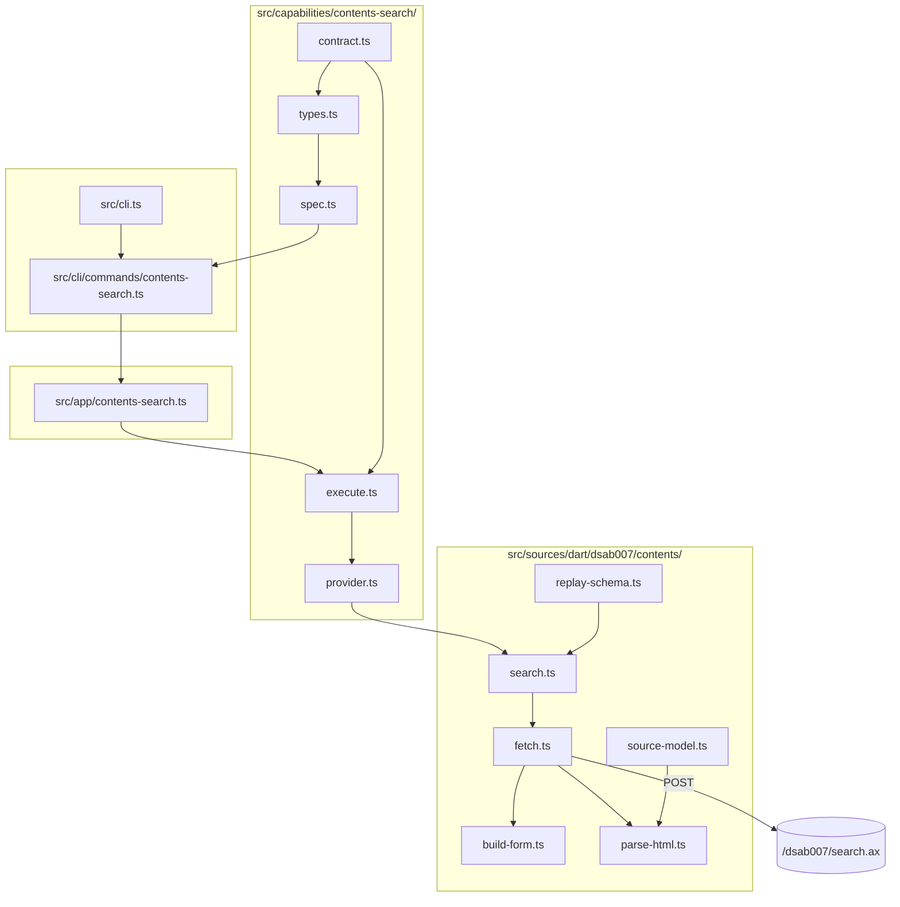
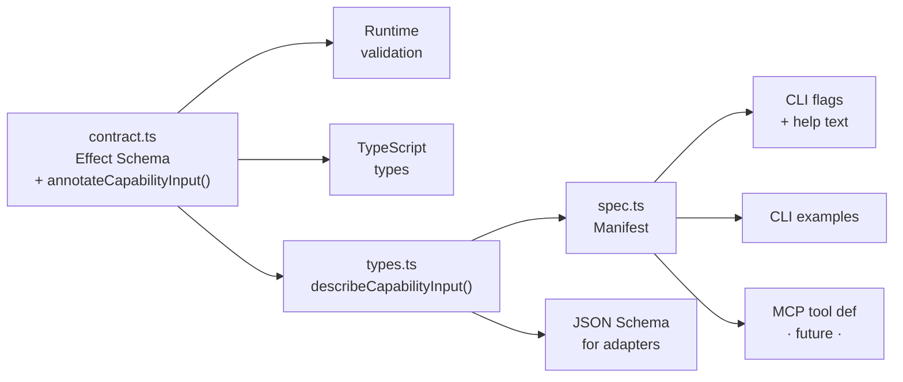
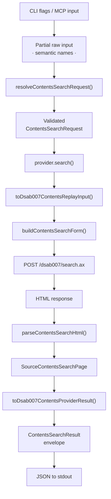
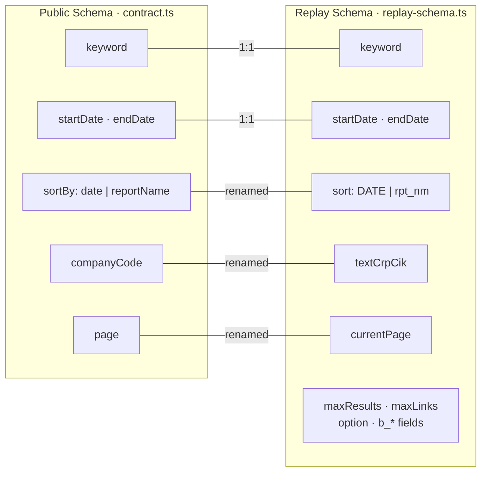
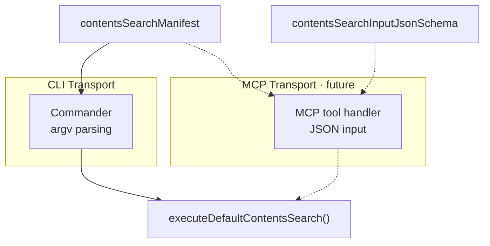

# Source Architecture

This document covers the current implementation under `src/`. It sits below the
repo-root [ARCHITECTURE.md](../ARCHITECTURE.md), which explains the broader repo
shape and document ownership.

## Purpose

`src/` contains the first executable slice of `darty`: one public
`contents-search` capability, one local CLI transport, and one internal DART
`dsab007` source adapter.

The design goal is to keep the core reusable across transports. The CLI is only
one host. MCP should be able to reuse the same capability contract, execution
path, and provider wiring.

## Layer Overview

The CLI is not the real app. The capability layer is: a semantic request
contract, a provider interface, and an execution path that normalizes errors and
shapes results. The CLI is one transport adapter over that core, and a future MCP
tool should sit at the same layer.

| Layer | Path | Owns |
|-------|------|------|
| **Transport** | `src/cli/` | Parse argv, build flags and help from manifest, print JSON |
| **Composition** | `src/app/` | Choose which provider backs a capability |
| **Capability** | `src/capabilities/` | Public contract, semantic validation, execution, metadata |
| **Source** | `src/sources/dart/` | DART replay fields, form POST, HTML parsing, error mapping |

## Component Map

- **`src/cli.ts`** — Root Commander program. Registers commands and turns
  failures into a process exit code.
- **`src/cli/commands/`** — Transport adapters. Build CLI flags and help text
  from capability-owned metadata, parse argv, print JSON on success.
- **`src/app/`** — Composition roots. Choose concrete providers for a
  capability without pushing source-specific imports into capability modules.
- **`src/capabilities/`** — Public, transport-neutral contracts and execution
  flow. Defines semantic inputs, public result shapes, typed failures, and
  manifest metadata.
- **`src/sources/dart/`** — Internal DART adapters. Owns replay schemas,
  request forms, HTML parsing, source models, and error mapping.

## Schema-First Design

The biggest design choice is **schema-first, transport-second**. One schema
definition drives runtime validation, TypeScript types, CLI flags, help text,
and JSON Schema for future adapters.

How it works:

1. **`contract.ts`** defines the public request schema using Effect Schema.
   `annotateCapabilityInput()` attaches human-facing metadata (description,
   aliases, defaults, status) as schema annotations.
2. **`types.ts`** walks the schema AST via `describeCapabilityInput()` and
   extracts a normalized `inputProperties` array plus JSON Schema.
3. **`spec.ts`** packages the schema with summary, notes, and examples into a
   transport-neutral manifest.
4. **`cli/commands/contents-search.ts`** imports the manifest and derives
   Commander flags, help text, and shell examples from it — no hand-written
   option strings.

One source of truth gives you:

- runtime validation shape
- TypeScript types
- CLI option definitions and help text
- enum/default/range metadata
- JSON Schema for future adapters

Without `annotateCapabilityInput()`, you'd have validation but not enough
information to generate good CLI or MCP metadata. The annotations are the
glue between schema-as-validation and schema-as-documentation.

## Runtime Flow

Step by step:

1. Transport (CLI or future MCP) converts transport syntax into a partial
   object keyed by public semantic names (`keyword`, `startDate`, etc.).
2. `resolveContentsSearchRequest()` applies defaults, validates required
   fields, checks enums and date formats, and rejects unknown parameters.
3. The composition root (`src/app/`) wires the validated request to the
   default `dsab007ContentsProvider`.
4. `toDsab007ContentsReplayInput()` translates the public request into the
   internal replay contract (`DATE`/`rpt_nm`, `textCrpCik`, `maxResults`).
5. `buildContentsSearchForm()` encodes the replay input as URLSearchParams
   and POSTs to `/dsab007/search.ax`.
6. `parseContentsSearchHtml()` extracts rows, pagination, and warnings from
   the HTML fragment.
7. `toDsab007ContentsProviderResult()` maps source rows into public items.
8. `buildContentsSearchResult()` wraps the provider result in a
   capability-owned envelope with metadata, references, and warnings.

Semantic validation happens inside the capability executor, not in the CLI.
This is important for MCP: MCP should call the same executor, not reimplement
validation.

## Two Schemas

There are two schemas in play, deliberately kept separate.

- **Public semantic schema** (`ContentsSearchRequestSchema` in `contract.ts`):
  what users and future MCP clients see. Semantic names, clean enums,
  documented metadata.
- **Internal replay schema** (`SourceContentsReplayInput` in
  `replay-schema.ts`): what DART's form actually expects. Raw field names,
  fixed page-size values, duplicated `b_*` parameters.

`toDsab007ContentsReplayInput()` is the only function that knows both. The
replay schema stays internal unless the product decides to expose lower-level
knobs.

## Transport Extension Seam

MCP should be straightforward because the layers are already separated.

An MCP transport should reuse:

- `contentsSearchManifest` — tool name, description, and examples
- `contentsSearchInputJsonSchema` — tool input schema
- `executeDefaultContentsSearch()` — shared validation, execution, and error
  normalization

CLI and MCP stay aligned automatically: one schema, one executor, two thin
transport shells.

## Start Here

- `src/cli.ts` — top-level transport entry point
- `src/cli/commands/contents-search.ts` — how manifest metadata becomes flags,
  examples, and stdout JSON
- `src/capabilities/contents-search/contract.ts` — public input and output
  contract
- `src/capabilities/contents-search/spec.ts` — transport-neutral metadata
  that MCP should reuse
- `src/capabilities/contents-search/execute.ts` — shared validation,
  execution, and error normalization
- `src/sources/dart/dsab007/contents/search.ts` — public-to-source mapping
  and provider boundary

## Test Coverage Map

Tests make the design relationships explicit:

- `spec.test.ts` — JSON Schema comes from the same input schema
- `contents-search.test.ts` — CLI help flags stay in sync with the manifest
- `contract.test.ts` — semantic resolution is shared and transport-independent
- `execute.test.ts` — provider errors get normalized into capability-owned failures
- `test/cli/` — subprocess CLI reflects the shared core

## Invariants

- Public capability modules do not import DART-specific replay schemas or parser
  models. That boundary keeps future transports independent from source details.
- CLI parsing stays shallow. Required fields, defaults, enum checks, and public
  validation happen in capability execution, not in Commander option handlers.
- Provider implementations return capability-shaped results, not raw source page
  structures.
- The replay contract is intentionally richer than the public contract. Fields
  that exist only to satisfy DART form behavior stay internal until the project
  decides they are stable public knobs.
- The capability schema is the single source of truth for transport metadata.
  CLI flags, help text, examples, and JSON Schema are derived from
  capability-owned metadata rather than duplicated by each transport.
